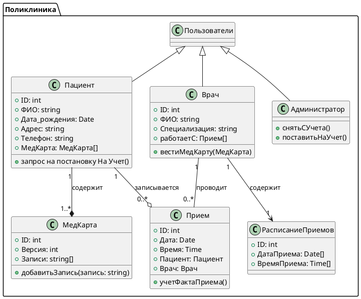

```plantuml
@startuml
package "Поликлиника" {

    class Пользователи {
               
    }

    class Пациент {
        +ID: int
        +ФИО: string
        +Дата_рождения: Date
        +Адрес: string
        +Телефон: string
        +МедКарта: МедКарта[]
        +запрос на постановку На Учет()
    }

    class Врач {
        +ID: int
        +ФИО: string 
        +Специализация: string
        +работаетС: Прием[]
        +вестиМедКарту(МедКарта)
    }

    class Администратор {
        +снятьСУчета()
        +поставитьНаУчет()
    }

    class Прием {
        +ID: int
        +Дата: Date
        +Время: Time
        +Пациент: Пациент
        +Врач: Врач
        +учетФактаПриема()
    }

    class МедКарта {
        +ID: int
        +Версия: int
        +Записи: string[]
        +добавитьЗапись(запись: string)
    }

    class РасписаниеПриемов {
        +ID: int
        +ДатаПриема: Date[]
        +ВремяПриема: Time[]
    }

    Пользователи <|-- Пациент
    Пользователи <|-- Администратор
    Пользователи <|-- Врач

    Пациент "1" --* "1..*" МедКарта : содержит
    Пациент "1" --o "0..*" Прием : записывается
    Врач "1" -- "0..*" Прием : проводит
    Врач "1" --> "1" РасписаниеПриемов : содержит
    
}
@enduml
```