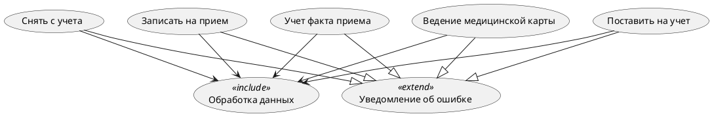

```plantuml
@startuml

usecase "Поставить на учет" as UC1
usecase "Снять с учета" as UC2
usecase "Записать на прием" as UC3
usecase "Учет факта приема" as UC4
usecase "Ведение медицинской карты" as UC5

usecase "Обработка данных" as UC6 <<include>>
usecase "Уведомление об ошибке" as UC7 <<extend>>

UC1 --> UC6
UC2 --> UC6
UC3 --> UC6
UC4 --> UC6
UC5 --> UC6

UC1 --|> UC7
UC2 --|> UC7
UC3 --|> UC7
UC4 --|> UC7
UC5 --|> UC7

@enduml
```