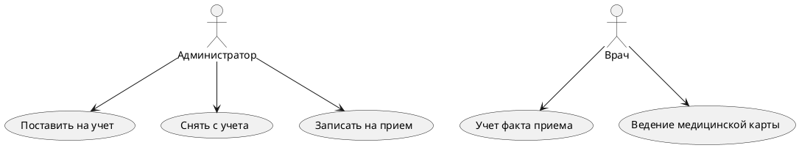

```plantuml
@startuml
actor "Администратор" as Admin
actor "Врач" as Doctor

usecase "Поставить на учет" as UC1
usecase "Снять с учета" as UC2
usecase "Записать на прием" as UC3
usecase "Учет факта приема" as UC4
usecase "Ведение медицинской карты" as UC5

Admin --> UC1
Admin --> UC2
Admin --> UC3
Doctor --> UC4
Doctor --> UC5
@enduml
```