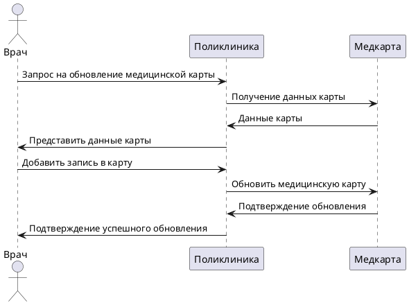

```plantuml
@startuml
actor Врач as D
participant "Поликлиника" as S
participant "Медкарта" as DB

D -> S: Запрос на обновление медицинской карты
S -> DB: Получение данных карты
DB -> S: Данные карты
S -> D: Представить данные карты
D -> S: Добавить запись в карту
S -> DB: Обновить медицинскую карту
DB -> S: Подтверждение обновления
S -> D: Подтверждение успешного обновления
@enduml
```