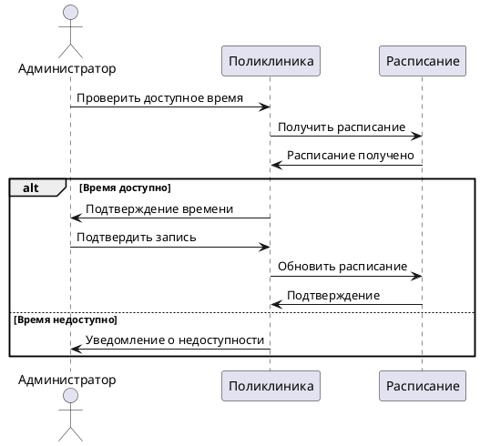

```plantuml
@startuml
actor Администратор as A
participant "Поликлиника" as S
participant "Расписание" as DB

A -> S: Проверить доступное время
S -> DB: Получить расписание
DB -> S: Расписание получено
alt Время доступно
    S -> A: Подтверждение времени
    A -> S: Подтвердить запись
    S -> DB: Обновить расписание
    DB -> S: Подтверждение
else Время недоступно
    S -> A: Уведомление о недоступности
end
@enduml
```