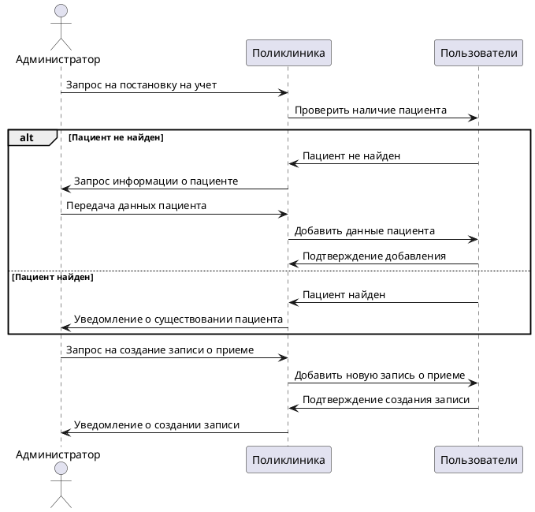

```plantuml
@startuml
actor Администратор as A
participant "Поликлиника" as S
participant "Пользователи" as DB

A -> S: Запрос на постановку на учет
S -> DB: Проверить наличие пациента
alt Пациент не найден
    DB -> S: Пациент не найден
    S -> A: Запрос информации о пациенте
    A -> S: Передача данных пациента
    S -> DB: Добавить данные пациента
    DB -> S: Подтверждение добавления
else Пациент найден
    DB -> S: Пациент найден
    S -> A: Уведомление о существовании пациента
end

A -> S: Запрос на создание записи о приеме
S -> DB: Добавить новую запись о приеме
DB -> S: Подтверждение создания записи
S -> A: Уведомление о создании записи
@enduml
```