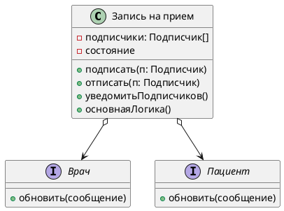

```plantuml
@startuml
class "Запись на прием" as Publisher {
    -подписчики: Подписчик[]
    -состояние
    +подписать(п: Подписчик)
    +отписать(п: Подписчик)
    +уведомитьПодписчиков()
    +основнаяЛогика()
}

interface "Врач" {
    +обновить(сообщение)
}

interface "Пациент" {
    +обновить(сообщение)
}

Publisher o--> "Врач"
Publisher o--> "Пациент"
@enduml
```