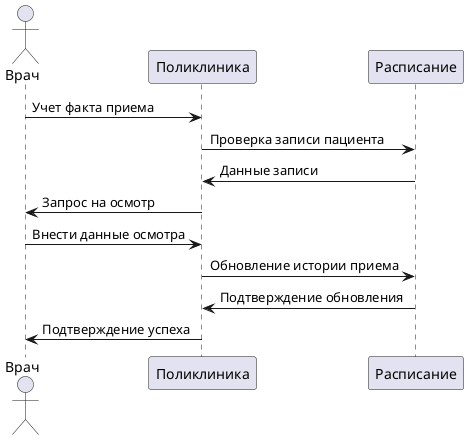

```plantuml
@startuml
actor Врач as D
participant "Поликлиника" as S
participant "Расписание" as DB

D -> S: Учет факта приема
S -> DB: Проверка записи пациента
DB -> S: Данные записи
S -> D: Запрос на осмотр
D -> S: Внести данные осмотра
S -> DB: Обновление истории приема
DB -> S: Подтверждение обновления
S -> D: Подтверждение успеха
@enduml
```