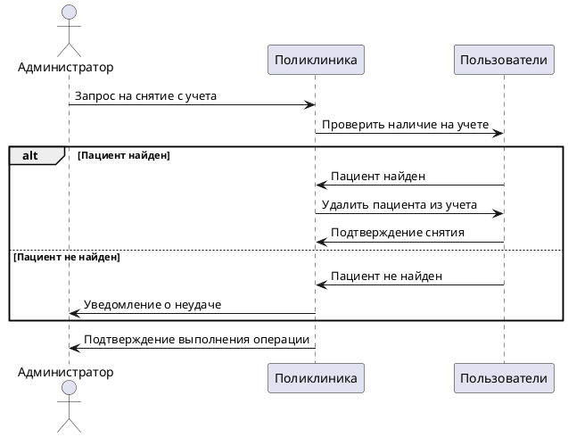

```plantuml
@startuml
actor Администратор as A
participant "Поликлиника" as S
participant "Пользователи" as DB

A -> S: Запрос на снятие с учета
S -> DB: Проверить наличие на учете
alt Пациент найден
    DB -> S: Пациент найден
    S -> DB: Удалить пациента из учета
    DB -> S: Подтверждение снятия
else Пациент не найден
    DB -> S: Пациент не найден
    S -> A: Уведомление о неудаче
end
S -> A: Подтверждение выполнения операции
@enduml
```